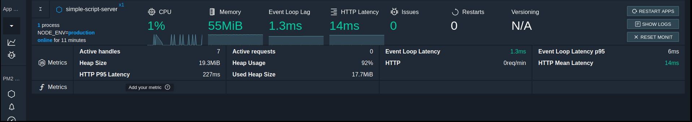
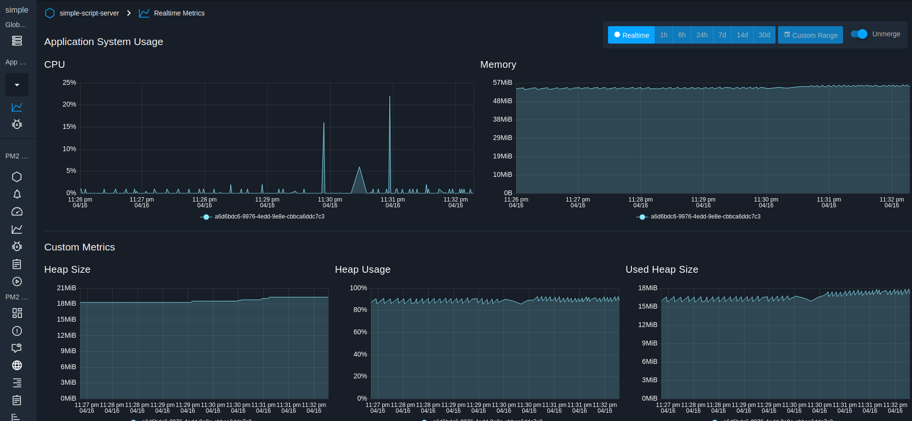

[](https://travis-ci.org/collinewait/simple-script) [](https://coveralls.io/github/collinewait/simple-script?branch=dev)

# Simple script

A simple fictitious app that creates scripts in a fake language.
Here is the [demo](https://drive.google.com/file/d/10LUDDOuGjh4KeUAI_eN3jQSbX8FLT_xx/view?usp=sharing) and a  [live](https://pensive-swartz-30859c.netlify.com) application


It was a coding challenge that required building a backend in node and a frontend in angular.
It has the following functionalities

- Users can register and log in with email and password.
- A user, once logged in, can create, update and delete "scripts" in a fake language.
  This language has three operations, each of which take a single argument (in JS format)
    ``` 
        DoThisThing(string)
        DoThatThing(integer)
        DoTheOtherThing(float)
    ```
    Scripts should be only the above three operations, each on its own line. Don't worry about what the script actually does
- Users can also "run" the scripts that they have created and save the output. 
- An admin can create and edit users, and view any scripts that they have created, and the output of any runs of that script.

The app is being monitored with pm2.io as shown below.




